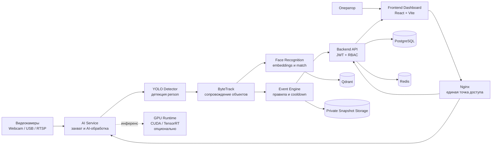
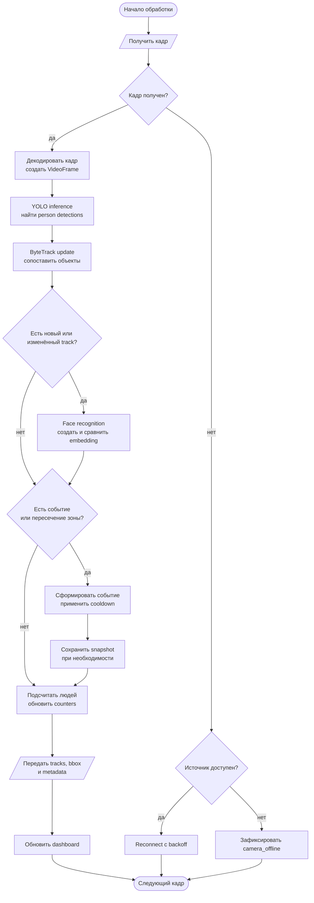
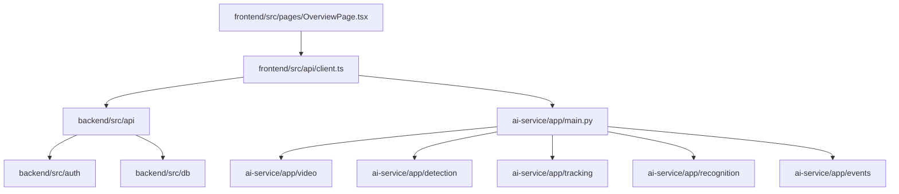

# OSV-PC: структурно-функциональная схема системы

## 1. Назначение документа

Документ описывает архитектуру OSV-PC в форме, пригодной для включения в техническую документацию, пояснительную записку или отчёт по проекту.

Схема подготовлена с ориентацией на:

- ГОСТ 2.701-2008 — виды и общие правила выполнения схем;
- ГОСТ 19.701-90 — схемы алгоритмов, программ, данных и систем;
- научные публикации по детекции объектов, сопровождению объектов и распознаванию лиц.

Mermaid-схема ниже является исходником документации. Для формальной сдачи её следует перенести в diagrams.net, Visio или CAD-среду с рамкой чертежа, основной надписью и графическими символами соответствующего ГОСТ.

## 2. Границы системы

**Внешние объекты:**

- Webcam, USB-камера или RTSP-камера;
- оператор системы;
- локальная сеть;
- NVIDIA GPU, если доступна;
- файловое хранилище snapshots.

**Внутренние подсистемы:**

- `frontend` — пользовательский интерфейс;
- `backend` — REST API, авторизация и бизнес-данные;
- `ai-service` — обработка видео и AI-аналитика;
- PostgreSQL — транзакционные данные;
- Redis — временные данные и очереди;
- Qdrant — векторные embeddings лиц.

## 3. Структурная схема подсистем



### 3.1. Назначение связей

| Связь | Содержание |
|---|---|
| Камера -> AI Service | Видеокадры или RTSP-поток |
| Frontend -> Backend | Авторизация, настройки, камеры, события |
| Frontend -> AI Service | Кадры browser-камеры и AI metadata |
| AI Service -> Detector | Изображение текущего кадра |
| Detector -> Tracker | Детекции, bbox и confidence |
| Tracker -> Recognition | Области tracked persons для распознавания |
| Tracker -> Event Engine | Track ID, bbox, timestamp и состояние объекта |
| Event Engine -> Backend | События безопасности и people count |
| Recognition -> Qdrant | Поиск ближайшего face embedding |
| Event Engine -> Snapshot Storage | Snapshots только для значимых событий |

## 4. Функциональная схема обработки кадра



## 5. Обозначения схемы

| Обозначение | Смысл в схеме |
|---|---|
| Овальный блок | Начало, окончание или переход процесса |
| Прямоугольник | Операция или функциональный блок |
| Ромб | Условие или точка принятия решения |
| Параллелограмм | Ввод или вывод данных |
| Цилиндр | База данных или постоянное хранилище |
| Сплошная стрелка | Основной поток данных или управления |
| Пунктирная стрелка | Опциональная зависимость, например GPU |

## 6. Алгоритм по этапам

### 6.1. Захват

`CameraManager` получает кадр от Webcam, USB или RTSP-источника. При ошибке соединения выполняется повторное подключение с backoff. Для browser-камеры frontend получает поток через `getUserMedia` и отправляет текущий JPEG-кадр в AI-service.

### 6.2. Детекция

YOLO выполняет одношаговую детекцию изображения и возвращает bbox, класс и confidence. В текущем MVP разрешён класс `person`, поэтому система не считает автомобили, животных и другие объекты без отдельной настройки модели.

### 6.3. Сопровождение

ByteTrack сопоставляет детекции между соседними кадрами и формирует устойчивый `track_id`. Координаты объекта обновляются на каждом доступном результате детектора. При временной потере объекта трек сохраняется в пределах `TRACK_TTL_FRAMES`.

### 6.4. Распознавание

Для выбранных tracked persons выполняется face recognition. Из области лица строится embedding, после чего выполняется поиск похожего вектора в Qdrant. Результат связывается с `track_id`, а не только с отдельным кадром.

### 6.5. События

Event Engine анализирует состояние треков и создаёт события обнаружения человека, входа в restricted zone, появления известного или неизвестного лица, offline-камеры и people count. Cooldown предотвращает повторную публикацию одного события.

### 6.6. Представление

Frontend получает metadata и отображает bbox поверх live-видео. Видео и координаты рамок являются разными потоками данных. При временной задержке AI frontend может сглаживать движение рамки, но это не заменяет реальный tracker.

## 7. Научное обоснование

### 7.1. YOLO

YOLO формулирует детекцию как регрессию координат bounding boxes и вероятностей классов за один проход нейронной сети. Это делает одношаговую архитектуру подходящей для видеопотока с ограниченной задержкой.

Источник: [Redmon et al., You Only Look Once: Unified, Real-Time Object Detection](https://arxiv.org/abs/1506.02640).

### 7.2. ByteTrack

ByteTrack сопоставляет не только детекции с высокой уверенностью, но и часть низкоуверенных детекций, что помогает сохранять траектории при частичном перекрытии или временном ухудшении изображения.

Источник: [Zhang et al., ByteTrack: Multi-Object Tracking by Associating Every Detection Box](https://arxiv.org/abs/2110.06864).

### 7.3. Face embeddings

Подход embeddings преобразует лицо в компактный вектор, где расстояние между векторами отражает степень сходства. Это позволяет отделить вычисление признаков лица от поиска в базе Qdrant.

Источник: [Schroff et al., FaceNet: A Unified Embedding for Face Recognition and Clustering](https://arxiv.org/abs/1503.03832).

## 8. Реализация в текущем MVP

В текущем MVP реализованы:

- YOLO person detection;
- browser endpoint `POST /ai/webcam/detect-frame`;
- ByteTrack для browser-детекции;
- возврат `tracks` и `track_id`;
- frontend overlay рамок;
- face embedding storage через Qdrant;
- event engine;
- PostgreSQL, Redis и private snapshots;
- CPU и NVIDIA Docker-конфигурации.

## 9. Ограничения текущей реализации

Browser-режим пока использует последовательную передачу JPEG через HTTP. Это проще для MVP, но создаёт задержку из-за кодирования, сети и YOLO inference.

Для production real-time рекомендуется заменить его на:

```text
WebRTC -> видеопоток
WebSocket -> tracks, bbox и события
AI worker -> обработка только последних кадров
```

Для GPU-режима требуется не только NVIDIA-карта, но и NVIDIA-драйвер, NVIDIA Container Toolkit, CUDA-enabled PyTorch и передача GPU в Docker Compose.

## 10. Проверяемые показатели

При испытаниях следует фиксировать:

- capture FPS;
- inference FPS;
- tracking FPS;
- среднюю и 95-й перцентиль end-to-end latency;
- precision и recall детекции людей;
- IDF1 и HOTA для трекинга;
- количество ID-switches;
- долю пропущенных детекций;
- потребление CPU, RAM и GPU VRAM.

Без этих измерений утверждение о real-time работе считается неполным.

## 11. Кодовая архитектура

### 11.1. Репозиторий

```text
TopGuard/
├── frontend/
│   └── src/
│       ├── App.tsx                  # состояние сессии и dashboard
│       ├── api/client.ts             # REST-клиенты backend и AI
│       ├── auth/session.ts           # sessionStorage и JWT-сессия
│       ├── components/               # AppShell, LoginScreen, StatusBadge
│       ├── pages/                    # Overview, Cameras, Events, People, Settings
│       ├── styles/app.css            # визуальный слой dashboard
│       └── types.ts                  # frontend-контракты API
│
├── ai-service/
│   └── app/
│       ├── main.py                   # FastAPI endpoints и сборка pipeline
│       ├── config.py                 # параметры камеры, AI и tracker
│       ├── detection/                # ObjectDetector, YOLO, schemas
│       ├── tracking/                 # ObjectTracker, ByteTrack, track state
│       ├── recognition/              # face embeddings и vector store
│       ├── events/                   # правила, cooldown и event publisher
│       ├── video/                    # CameraManager, Webcam, RTSP, frames
│       └── storage/                  # snapshots
│
├── backend/
│   └── src/
│       ├── main.py                   # FastAPI application
│       ├── config.py                 # backend settings
│       ├── api/                      # public и internal routes
│       ├── auth/                     # JWT, users и RBAC
│       ├── services/                 # бизнес-операции
│       ├── db/                       # SQLAlchemy и repositories
│       ├── schemas/                  # request/response contracts
│       └── middleware/               # cross-cutting middleware
│
└── infra/
        ├── docker-compose.yml            # CPU deployment
        ├── docker-compose.gpu.yml        # NVIDIA override
        └── nginx/nginx.conf               # маршрутизация /api и /ai
```

### 11.2. Границы модулей

| Модуль | Основные файлы | Ответственность | Не должен делать |
|---|---|---|---|
| UI | `frontend/src/pages`, `components` | Видео, рамки, формы и навигация | Вычислять бизнес-события |
| API client | `frontend/src/api/client.ts` | HTTP-контракты frontend | Хранить секреты и правила доступа |
| AI composition root | `ai-service/app/main.py` | Сборка detector/tracker/recognition pipeline | Быть источником бизнес-данных |
| Detection | `ai-service/app/detection` | YOLO и фильтрация классов | Хранить track state |
| Tracking | `ai-service/app/tracking` | `track_id`, bbox и TTL треков | Распознавать лицо |
| Recognition | `ai-service/app/recognition` | Embedding и поиск в Qdrant | Управлять пользователями |
| Events | `ai-service/app/events` | Rules, cooldown и публикация | Отдавать публичный API |
| Backend API | `backend/src/api` | JWT, RBAC, CRUD и internal API | Выполнять тяжёлый inference |
| Persistence | `backend/src/db`, PostgreSQL | Источник истины бизнес-данных | Заменять transient tracker state |

### 11.3. Граф зависимостей кода



### 11.4. Фактический browser runtime flow

```text
OverviewPage.detectBrowserFrame()
    -> captureBrowserFrame()
    -> onDetectWebcam(blob)
    -> App.handleWebcamDetect()
    -> detectWebcamFrame()
    -> POST /ai/webcam/detect-frame
    -> decode_uploaded_image()
    -> detect_people()
    -> browser_tracker.update()
    -> tracks + detections
    -> setWebcamDetection()
    -> OverviewPage displayDetections
    -> bbox overlay over <video>
```

`browser_tracker` отделён от tracker одноразового camera endpoint, чтобы состояние browser-трекинга не загрязняло системный `/ai/tracker/status`.

### 11.5. Контракты между слоями

Основные модели данных:

| Контракт | Владелец | Назначение |
|---|---|---|
| `VideoFrame` | `ai-service/app/video` | Изображение, camera ID, sequence, timestamp |
| `Detection` | `ai-service/app/detection/schemas.py` | Результат YOLO |
| `TrackedObject` | `ai-service/app/tracking/schemas.py` | Детекция с устойчивым `track_id` |
| `WebcamDetection` | `frontend/src/types.ts` | Ответ browser endpoint |
| `VisionEvent` | `ai-service/app/events/schemas.py` | Нормализованное событие аналитики |
| `Settings` | `backend/src/schemas` и frontend types | Пороговые значения и параметры системы |

Минимальный contract live-детекции:

```json
{
    "camera_id": "browser-webcam",
    "frame_sequence": 1520,
    "person_count": 1,
    "detections": [],
    "tracks": [
        {
            "track_id": 7,
            "class_name": "person",
            "confidence": 0.91,
            "bbox": {"x1": 320, "y1": 120, "x2": 560, "y2": 620},
            "hits": 18
        }
    ]
}
```

### 11.6. Состояние и жизненный цикл

| Состояние | Где хранится | Жизненный цикл |
|---|---|---|
| JWT-сессия | browser `sessionStorage` | До logout, истечения или 401 |
| Live stream | browser `MediaStream` | Между включением и отключением камеры |
| Browser tracks | `browser_tracker` в AI-service | Пока активен процесс AI и не истёк TTL |
| Events | PostgreSQL | По retention policy |
| Face embeddings | Qdrant | До удаления профиля/embedding |
| Snapshots | Private storage | По retention policy |

### 11.7. Целевое расширение кодовой архитектуры

Для production real-time необходимо добавить отдельные компоненты:

```text
ai-service/app/runtime/camera_worker.py
ai-service/app/runtime/frame_queue.py
ai-service/app/transport/websocket.py
frontend/src/live/useLiveCamera.ts
frontend/src/live/TrackOverlay.tsx
```

Их ответственность:

1. `camera_worker.py` — постоянное чтение источника и обработка последних кадров.
2. `frame_queue.py` — bounded queue с отбрасыванием устаревших кадров.
3. `websocket.py` — передача tracks, событий и latency metadata.
4. `useLiveCamera.ts` — жизненный цикл WebSocket/WebRTC в браузере.
5. `TrackOverlay.tsx` — отрисовка bbox на canvas без перерисовки всей страницы.

## 12. Библиографический список

1. Redmon J., Divvala S., Girshick R., Farhadi A. *You Only Look Once: Unified, Real-Time Object Detection*. arXiv:1506.02640, 2016.
2. Zhang Y., Sun P., Jiang Y. et al. *ByteTrack: Multi-Object Tracking by Associating Every Detection Box*. arXiv:2110.06864, 2022.
3. Schroff F., Kalenichenko D., Philbin J. *FaceNet: A Unified Embedding for Face Recognition and Clustering*. CVPR 2015; arXiv:1503.03832.
4. ГОСТ 2.701-2008. ЕСКД. Схемы. Виды и типы. Общие требования к выполнению.
5. ГОСТ 19.701-90. ЕСПД. Схемы алгоритмов, программ, данных и систем. Обозначения условные графические и правила выполнения.
