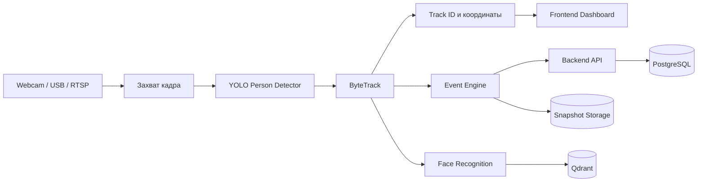

# OSV-PC: алгоритм работы системы

## 1. Назначение

OSV-PC — система видеоаналитики для обнаружения и подсчёта людей в видеопотоке.

Система выполняет следующие задачи:

- получает изображение с Webcam, USB или RTSP-камеры;
- обнаруживает людей с помощью YOLO;
- сопровождает найденные объекты с помощью ByteTrack;
- отображает рамки и идентификаторы объектов в dashboard;
- формирует события безопасности;
- распознаёт лица известных людей;
- сохраняет события, embeddings и snapshots.

Текущая версия ориентирована на класс `person`. Произвольные объекты пока не являются частью основного MVP-сценария.

## 2. Общая схема



## 3. Последовательность обработки кадра

### Шаг 1. Получение кадра

Для browser-камеры frontend:

1. Запрашивает доступ через `getUserMedia`.
2. Показывает живое видео в элементе `<video>`.
3. Копирует текущий кадр в скрытый `<canvas>`.
4. Кодирует кадр в JPEG.
5. Отправляет кадр в AI-сервис через `POST /ai/webcam/detect-frame`.

Для Webcam, USB или RTSP-источника в AI-сервисе используется `CameraManager` и OpenCV.

### Шаг 2. Подготовка изображения

AI-сервис:

1. Принимает JPEG или кадр от `CameraManager`.
2. Декодирует изображение.
3. Создаёт объект `VideoFrame`.
4. Присваивает кадру `camera_id`, sequence и timestamp.

### Шаг 3. Детекция YOLO

YOLO анализирует кадр и возвращает найденные области.

Для каждой области формируются:

- `class_name`;
- `class_id`;
- `confidence`;
- координаты `bbox`;
- размеры кадра;
- время и номер кадра.

В MVP разрешён класс `person`. Объекты с confidence ниже `PERSON_CONFIDENCE_THRESHOLD` отбрасываются.

### Шаг 4. Сопровождение ByteTrack

ByteTrack получает детекции текущего кадра и сравнивает их с предыдущими объектами.

Для каждого продолжающего движение человека трекер сохраняет:

- `track_id`;
- текущую рамку;
- confidence;
- количество успешных совпадений `hits`;
- последний кадр;
- время последнего появления.

Если человек временно пропал, трекер сохраняет его в течение `TRACK_TTL_FRAMES`. После истечения TTL объект удаляется.

Пример результата:

```json
{
  "track_id": 7,
  "class_name": "person",
  "confidence": 0.91,
  "bbox": {
    "x1": 320,
    "y1": 120,
    "x2": 560,
    "y2": 620,
    "width": 240,
    "height": 500
  },
  "hits": 18
}
```

### Шаг 5. Передача результата в frontend

Frontend получает:

- количество людей;
- список детекций;
- список tracked objects;
- `track_id`;
- координаты рамок;
- confidence;
- номер и время кадра.

Живое видео и metadata разделены: frontend показывает поток камеры, а рамки рисует поверх него.

Между ответами AI frontend использует сглаживание положения рамки. Новый ответ YOLO корректирует прогноз.

### Шаг 6. Распознавание лица

Распознавание лица выполняется отдельно от основной детекции:

1. Для tracked person выбирается область лица.
2. Изображение преобразуется в embedding.
3. Embedding сравнивается с Qdrant.
4. Человек классифицируется как известный или неизвестный.
5. Результат привязывается к `track_id`.

Распознавание не требуется выполнять на каждом кадре. Рекомендуемый режим — запуск при появлении нового трека и периодическое обновление результата.

### Шаг 7. Формирование событий

Event Engine формирует события:

- `person_detected`;
- `known_person_detected`;
- `unknown_person_detected`;
- `restricted_zone_entry`;
- `camera_offline`;
- `people_count`.

Для защиты от повторов используются:

- `camera_id`;
- `track_id`;
- тип события;
- cooldown;
- время последнего события.

### Шаг 8. Сохранение данных

Backend и хранилища используются следующим образом:

| Данные | Хранилище |
|---|---|
| Пользователи, камеры, события, настройки | PostgreSQL |
| Face embeddings | Qdrant |
| Snapshots событий | Private storage |
| Временные очереди и служебные данные | Redis |

Видео по умолчанию не должно сохраняться целиком. Сохраняются только snapshots, связанные с событиями.

## 4. API-поток browser-камеры

```text
Frontend getUserMedia
    -> canvas.toBlob()
    -> POST /ai/webcam/detect-frame
    -> decode_uploaded_image()
    -> YOLO detector
    -> browser_tracker.update()
    -> tracks + detections
    -> frontend overlay
```

## 5. Текущий режим и ограничения

Текущая browser-детекция использует последовательные HTTP-запросы JPEG-кадров. Это рабочий MVP-режим, но задержка зависит от:

- времени JPEG-кодирования;
- сетевого запроса;
- скорости YOLO inference;
- мощности CPU или GPU;
- времени ответа AI-сервиса.

Текущая схема не является полноценным 30 FPS video pipeline. Для минимальной задержки рекомендуется следующая архитектура:

```text
WebRTC — видеопоток
WebSocket — координаты рамок и события
AI worker — постоянная обработка последних кадров
```

Очередь кадров должна хранить только последний или предпоследний кадр. Старые кадры необходимо отбрасывать, иначе задержка будет накапливаться.

## 6. CPU и NVIDIA GPU

CPU-запуск:

```powershell
docker compose -f .\\infra\\docker-compose.yml up -d
```

NVIDIA-запуск:

```powershell
docker compose `
  -f .\\infra\\docker-compose.yml `
  -f .\\infra\\docker-compose.gpu.yml `
  up -d --build ai-service
```

Для GPU необходимы:

- совместимый NVIDIA-драйвер;
- Docker Desktop или Docker Engine с GPU-поддержкой;
- NVIDIA Container Toolkit;
- CUDA-enabled PyTorch-образ;
- доступ контейнера к GPU.

Простое наличие NVIDIA-видеокарты без этих компонентов GPU не активирует.

## 7. Целевые показатели production-режима

| Компонент | Целевое значение |
|---|---:|
| Захват видео | 25–30 FPS |
| YOLO inference | 10–20 FPS |
| ByteTrack | 25–30 FPS |
| Распознавание лица | 1–3 раза в секунду на трек |
| Подсчёт людей | 1 раз в секунду |
| События | по изменению состояния и cooldown |

## 8. Следующие технические этапы

1. Добавить постоянный worker обработки камеры.
2. Перевести metadata с HTTP polling на WebSocket.
3. Передавать видео через WebRTC или другой потоковый транспорт.
4. Подключить ByteTrack к каждому постоянному camera worker.
5. Добавить метрики capture FPS, inference FPS и end-to-end latency.
6. Вынести face recognition в отдельную очередь.
7. Добавить отдельный worker на каждую камеру.
8. Добавить нагрузочные тесты для нескольких камер.
